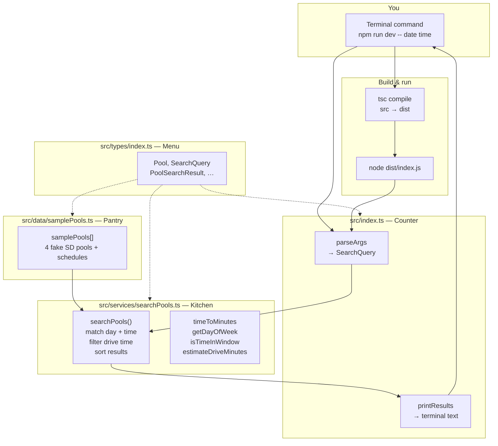
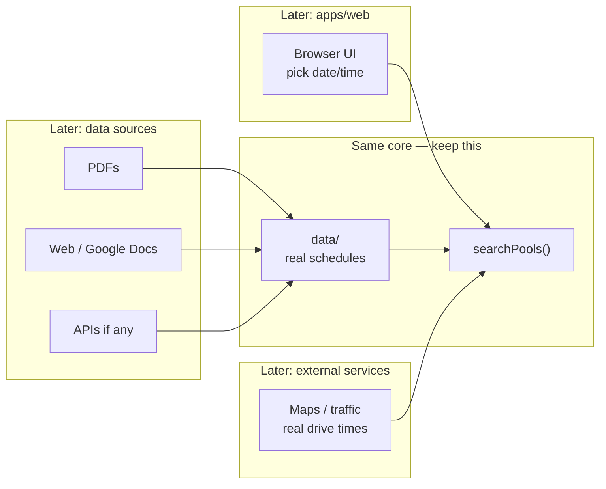

# Project cheat sheet

## The restaurant analogy


| Folder / file   | Role                                                            |
| --------------- | --------------------------------------------------------------- |
| `src/types/`    | Menu definitions — what a pool, search, and result must include |
| `src/data/`     | Pantry — pool schedules (fake sample data for now)              |
| `src/services/` | Kitchen — picks pools that match your date/time                 |
| `src/index.ts`  | Counter — you ask; it prints answers in the terminal            |


## When you run the app

1. You run a command (e.g. `npm run dev`)
2. TypeScript in `src/` compiles to JavaScript in `dist/`
3. Node runs that JavaScript
4. Load pools → search → print results

## Config files (not the app logic)

- `**package.json**` — project name + npm shortcuts (`build`, `start`, `dev`)
- `**tsconfig.json**` — TypeScript rules; `src/` → `dist/`
- `**.gitignore**` — don’t commit `node_modules/` or `dist/`
- `**README.md**` — how to install and run (for you)

## Main code files (read in this order)

1. `src/types/index.ts` — data shapes
2. `src/data/samplePools.ts` — 4 fake SD pools
3. `src/services/searchPools.ts` — matching + sort
4. `src/index.ts` — CLI entry, calls search

## Request funnel (one query)

1. Terminal: `npm run dev -- date time`
2. **Counter** (`index.ts`): `parseArgs` → `SearchQuery` → call `searchPools(samplePools, query)`
3. **Kitchen** (`searchPools.ts`): for each pool — match day + time window → else skip → drive filter → add to results → sort
4. **Counter**: `printResults` → text in terminal

Example: Mon `2026-05-18` `06:30` → La Jolla + Mission Valley + Coronado; UCSD skipped (no Monday in sample data).

## Quick glossary


| Term                          | Meaning                                                            |
| ----------------------------- | ------------------------------------------------------------------ |
| TypeScript                    | JavaScript with type checklists                                    |
| Build / compile               | Turn `.ts` files into `.js` in `dist/`                             |
| `src/`                        | Source code you edit                                               |
| `dist/`                       | Compiled output Node runs (regenerate with `npm run build`)        |
| Node                          | Runs JavaScript on your computer                                   |
| npm                           | Installs packages; runs scripts from `package.json`                |
| `npm install`                 | Download `devDependencies` into `node_modules/`                    |
| `devDependencies`             | Build tools (here: TypeScript), not the swim logic itself          |
| `node_modules/`               | Installed packages; don’t edit; don’t commit                       |
| `npm run dev`                 | Build (`tsc`) then run (`node dist/index.js`)                      |
| Interface                     | Checklist for what fields an object must have                      |
| `export` / `export interface` | Let other files import that type or value                          |
| `import type`                 | Import types only (erased when compiled)                           |
| `string`                      | Text in quotes, e.g. `"06:30"`                                     |
| `string[]`                    | List of strings (e.g. command-line args)                           |
| `const`                       | Named value you don’t reassign                                     |
| `??` (nullish coalescing)     | If the left side is only `null` or `undefined`, use the right side. Example in kitchen: drive lookup, else `30`. Does not fall back on `0` or `""`. |
| OR operator (two pipes)       | Logical OR, or “use fallback when left is falsy” (`null`, `undefined`, `0`, `""`, `false`). This repo uses `??` for defaults when only “missing” should count. Written in code as two pipe characters side by side. |
| CLI                           | App you run in the terminal (text in, text out)                    |
| Arguments (args)              | Extra words after the command that tell your app what to do. Example: `npm run dev -- 2026-05-18 06:30 cost` → args are `2026-05-18`, `06:30`, `cost`. Everything after `--` goes to your app, not npm. |
| `argv`                        | Short for “argument vector” — the list of strings Node hands your program. Same idea as args; `process.argv` is that list in code. Index 2+ are usually *your* args (date, time, sort). |
| `process.argv`                | In Node: the actual `argv` array for this run (`[node path, script path, …your args]`). |
| Parse                         | Read messy text input and turn it into structured fields the code can use (e.g. date, time, sort). Not a special keyword — we name helpers `parseSomething`. |
| `parseArgs`                   | Counter: parse `argv` into a `SearchQuery` (`date`, `time`, optional `sortBy`, optional `maxDriveMinutes`); returns `null` if date/time missing |
| `parseSortBy`                 | Counter: parse optional 4th CLI word into `distance` or `cost` (or ignore invalid) |
| `SearchQuery`                 | What you want: `date`, `time`, optional `sortBy`, `maxDriveMinutes` |
| `samplePools`                 | Pantry: array of fake pools + schedules                            |
| `searchPools()`               | Kitchen: filter + sort; returns `PoolSearchResult[]`               |
| `Record`                      | TypeScript type for a lookup table: each **key** (string) maps to one **value** (here, a number). Example: pool id → drive minutes. Not a list — you fetch by name with brackets. |
| Bracket lookup                | Read one entry from a table: `table[key]`. Example: `ESTIMATED_DRIVE_MINUTES[pool.id]` → minutes for that pool, or `undefined` if the id is missing. |
| `continue`                    | Skip rest of loop for this pool; move to next pool                 |
| `.find()`                     | First schedule window that matches day + time                      |
| Funnel                        | Each pool in or out: match window → drive filter → results → print |


## Weekdays in code (`dayOfWeek`)

0 = Sunday · 1 = Monday · 2 = Tuesday · 3 = Wednesday · 4 = Thursday · 5 = Friday · 6 = Saturday

## System diagrams

How the pieces fit together. View in Cursor/GitHub preview, or paste the `mermaid` blocks into [mermaid.live](https://mermaid.live).

### V0 today (what’s in the repo)




**One request:** You type date/time → counter builds a question → kitchen checks each pool in the pantry → counter prints what survived the funnel.

**Code path to follow:** `index.ts` (bottom) → `searchPools.ts` → `samplePools.ts` → back to `printResults`.

### Later (product vision — not built yet)




**Idea:** UI and data collection change; `searchPools` + types stay the center.

---

## Session learnings (saved)

**Organization:** menu (`types/`) → pantry (`data/`) → kitchen (`services/`) → counter (`index.ts`).

**Flow:** Input date/time → `searchPools` funnel (match window → drive filter → sort) → printed summary (not a raw data dump).

**Concepts touched:** `export interface`, `string` / `string[]`, `const`, `parseArgs` / `process.argv`, `npm install` / `node_modules` / `devDependencies`, compile `src` → `dist`.

**Still building depth on:** line-by-line kitchen logic — revisit when we change that code.

**Product stance:** incremental slices + small ships (CLI → web → one real pool); tiny feature next.

**Repo state:** All `src/` files have learning comments; `npm install` has been run at least once in this project.

---

## Resume here (next session)

**Use a new Agent chat** (not this thread). Open folder `Prototype Exercise`; Cursor reads `AGENTS.md` automatically.

**Read first:** This file (funnel + glossary + diagrams above), `AGENTS.md`, `VISION.md`.

**Done (project so far):**

- Walked all of `src/` (types → data → services → index); inline learning comments throughout
- `npm install` + run & trace; funnel mental model + system diagrams in this file
- 4th fake pool (Coronado) in `samplePools.ts` — shows on Monday AM test query
- Sort: CLI 4th arg `distance` \| `cost` (`parseSortBy`, `parseArgs`); `SearchQuery.sortBy`; kitchen sort branches
- Glossary expanded: parse, args, `argv`, `??`, OR (`||`), `Record`, bracket lookup
- Drive filter in kitchen uses `maxDriveMinutes` on `SearchQuery` (demo default `30` in `index.ts` when no CLI args)

**Next (tiny slice):**

- `maxDriveMinutes` from CLI (5th arg or flag) — kitchen already filters; counter still hardcodes demo only
- Optional: Thursday lunch query (`npm run dev -- 2026-05-21 12:15`) to see UCSD + Coronado lunch windows

**How to work with the agent:** Short steps · explain any new code · gray comments in files · wait for **got it** before the next chunk.

**Run commands (sanity check):**

```bash
cd "/Users/benstern/Prototype Exercise"
npm run dev -- 2026-05-18 06:30
npm run dev -- 2026-05-18 06:30 cost
```

**Paste into the new chat:**

> Resume the SD lap lane project. Read `notes.md` from **Resume here** and **Session learnings** (plus funnel, glossary, system diagrams). Read `AGENTS.md` and `VISION.md`. Coronado pool and CLI sort (`distance`/`cost`) are done; `maxDriveMinutes` from CLI is the next tiny slice. Small steps, explain new code with inline comments, confirm **got it** as we go.

