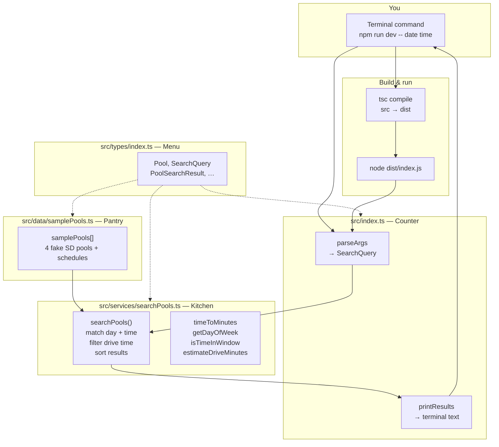
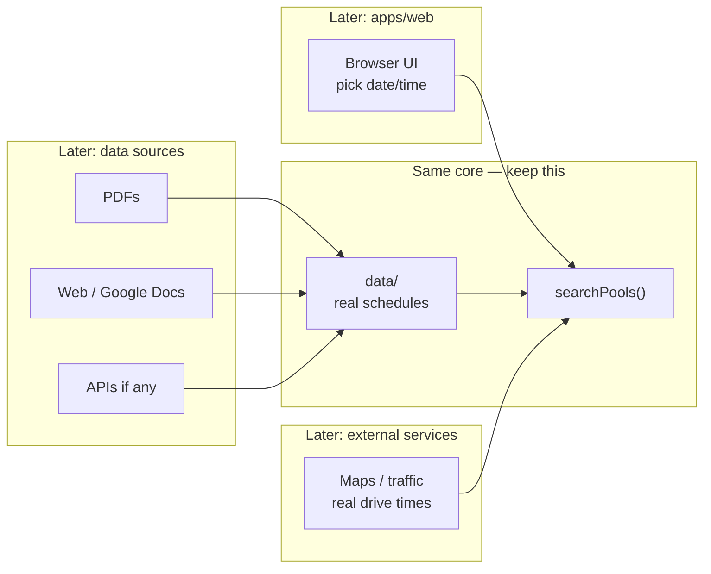

# Project cheat sheet

## The restaurant analogy


| Folder / file   | Role                                                            |
| --------------- | --------------------------------------------------------------- |
| `src/types/`    | Menu definitions — what a pool, search, and result must include |
| `src/data/`     | Pantry — `pools.json` real schedules only (`samplePools.ts` is demo-only) |
| `src/services/` | Kitchen — picks pools that match your date/time                 |
| `src/index.ts`  | Terminal counter — CLI; prints answers in the terminal        |
| `src/server.ts` | Web counter — serves the browser page and `/api/search`         |
| `src/web/app.ts`| Browser logic — date/time UI, calls the API, draws results      |
| `public/`       | What you see — `index.html`, `styles.css`, `hero-swimmer.png`   |


## When you run the app

**Terminal (CLI):**

1. `npm run dev` (optional: `-- date time`)
2. TypeScript in `src/` compiles to JavaScript in `dist/`
3. Node runs `dist/index.js`
4. Load pools → search → print results

**Browser (web UI):**

1. `npm run web`
2. Open **http://localhost:3000** in Chrome/Safari (edit files in Cursor; view the app in the browser)
3. Node runs `dist/server.js` — serves `public/` and answers `/api/search`
4. Click **Find Open Lanes** → browser requests API → same kitchen → results on screen 2

## Config files (not the app logic)

- `**package.json**` — project name + npm shortcuts (`build`, `start`, `dev`)
- `**tsconfig.json**` — TypeScript rules; `src/` → `dist/`
- `**.gitignore**` — don't commit `node_modules/` or `dist/`
- `**README.md**` — how to install and run (for you)

## Main code files (read in this order)

1. `src/types/index.ts` — data shapes
2. `src/data/samplePools.ts` — 4 fake SD pools
3. `src/services/searchPools.ts` — matching + sort
4. `src/index.ts` — CLI entry, calls search

## Request funnel (one query)

1. Terminal: `npm run dev -- date time`
2. **Counter** (`index.ts`): `parseArgs` → `SearchQuery` → call `searchPools(samplePools, query)`
3. **Kitchen** (`searchPools.ts`): for each pool — match day + time window → else skip → drive filter → add to results → sort
4. **Counter**: `printResults` → text in terminal

Example: Mon `2026-05-18` `06:30` → La Jolla + Mission Valley + Coronado; UCSD skipped (no Monday in sample data).

## Quick glossary


| Term                          | Meaning                                                            |
| ----------------------------- | ------------------------------------------------------------------ |
| TypeScript                    | JavaScript with type checklists                                    |
| Build / compile               | Turn `.ts` files into `.js` in `dist/`                             |
| `src/`                        | Source code you edit                                               |
| `dist/`                       | Compiled output Node runs (regenerate with `npm run build`)        |
| Node                          | Runs JavaScript on your computer                                   |
| npm                           | Installs packages; runs scripts from `package.json`                |
| `npm install`                 | Download `devDependencies` into `node_modules/`                    |
| `devDependencies`             | Build tools (here: TypeScript), not the swim logic itself          |
| `node_modules/`               | Installed packages; don't edit; don't commit                       |
| `npm run dev`                 | Build (`tsc`) then run (`node dist/index.js`)                      |
| Interface                     | Checklist for what fields an object must have                      |
| `export` / `export interface` | Let other files import that type or value                          |
| `import type`                 | Import types only (erased when compiled)                           |
| `string`                      | Text in quotes, e.g. `"06:30"`                                     |
| `string[]`                    | List of strings (e.g. command-line args)                           |
| `const`                       | Named value you don't reassign                                     |
| `??` (nullish coalescing)     | If the left side is only `null` or `undefined`, use the right side. Example in kitchen: drive lookup, else `30`. Does not fall back on `0` or `""`. |
| OR operator (two pipes)       | Logical OR, or "use fallback when left is falsy" (`null`, `undefined`, `0`, `""`, `false`). This repo uses `??` for defaults when only "missing" should count. Written in code as two pipe characters side by side. |
| CLI                           | App you run in the terminal (text in, text out)                    |
| Arguments (args)              | Extra words after the command that tell your app what to do. Example: `npm run dev -- 2026-05-18 06:30 cost` → args are `2026-05-18`, `06:30`, `cost`. Everything after `--` goes to your app, not npm. |
| `argv`                        | Short for "argument vector" — the list of strings Node hands your program. Same idea as args; `process.argv` is that list in code. Index 2+ are usually *your* args (date, time, sort). |
| `process.argv`                | In Node: the actual `argv` array for this run (`[node path, script path, …your args]`). |
| Parse                         | Read messy text input and turn it into structured fields the code can use (e.g. date, time, sort). Not a special keyword — we name helpers `parseSomething`. |
| `parseArgs`                   | Counter: parse `argv` into a `SearchQuery` (`date`, `time`, optional `sortBy`, optional `maxDriveMinutes`); returns `null` if date/time missing |
| `parseSortBy`                 | Counter: parse optional 4th CLI word into `distance` or `cost` (or ignore invalid) |
| `SearchQuery`                 | What you want: `date`, `time`, optional `sortBy`, `maxDriveMinutes` |
| `samplePools`                 | Pantry: array of fake pools + schedules                            |
| `searchPools()`               | Kitchen: filter + sort; returns `PoolSearchResult[]`               |
| `Record`                      | TypeScript type for a lookup table: each **key** (string) maps to one **value** (here, a number). Example: pool id → drive minutes. Not a list — you fetch by name with brackets. |
| Bracket lookup                | Read one entry from a table: `table[key]`. Example: `ESTIMATED_DRIVE_MINUTES[pool.id]` → minutes for that pool, or `undefined` if the id is missing. |
| `continue`                    | Skip rest of loop for this pool; move to next pool                 |
| `.find()`                     | First schedule window that matches day + time                      |
| Funnel                        | Each pool in or out: match window → drive filter → results → print |
| **API**                       | **A**pplication **P**rogramming **I**nterface — an agreed way for two programs to ask each other for data. In this repo: the browser orders from `server.ts`; the server runs `searchPools()` and sends back a list. You don't put kitchen logic in the browser. |
| Request                       | The ask — e.g. browser: "lanes for 2026-05-18 at 09:00?" Implemented as a URL: `GET /api/search?date=…&time=…` |
| Response                      | The answer the server sends back — here, JSON text with `query` and `results`. |
| Endpoint                      | One "menu item" on the server — ours is **`/api/search`** (lane search only). |
| `GET`                         | HTTP verb meaning "read data only" (no form body). Our search uses GET because date/time sit in the URL. |
| JSON                          | Text shaped like `{ "name": "La Jolla YMCA", "lanesAvailable": 4 }` — easy for TypeScript/JavaScript to parse. |
| `localhost`                   | "This computer." **`localhost:3000`** = web app running on your machine while you develop (not on the public internet). |
| `fetch()`                     | Browser built-in: send a request to a URL and get the response (used in `src/web/app.ts` for `/api/search`). |
| **curl**                      | Terminal tool to fetch a URL and print the response — test the **API** without a browser. Same **Endpoint** as `fetch()`: e.g. `curl "http://localhost:3000/api/search?date=…&time=…"` sends a **GET** **Request**; server sends back **JSON** **Response**. |
| `npm run web`                 | Build TypeScript, then start `dist/server.js` — open http://localhost:3000 to use the UI sample. |

### API in this project (restaurant again)

| Piece | File | Role |
| ----- | ---- | ---- |
| Customer | Browser + `src/web/app.ts` | Clicks Find Open Lanes |
| Counter | `src/server.ts` | Receives `/api/search`, calls kitchen |
| Kitchen | `src/services/searchPools.ts` | Same funnel as CLI |
| Menu line | `GET /api/search?date=&time=&sortBy=&maxDriveMinutes=` | The only API endpoint in V0 |

**Why use an API?** Same kitchen can serve CLI, web, and later a phone app — only the "how you order" changes (terminal args vs URL).

## Weekdays in code (`dayOfWeek`)

0 = Sunday · 1 = Monday · 2 = Tuesday · 3 = Wednesday · 4 = Thursday · 5 = Friday · 6 = Saturday

## System diagrams

How the pieces fit together. View in Cursor/GitHub preview, or paste the `mermaid` blocks into [mermaid.live](https://mermaid.live).

### V0 today (what's in the repo)




**One request:** You type date/time → counter builds a question → kitchen checks each pool in the pantry → counter prints what survived the funnel.

**Code path to follow:** `index.ts` (bottom) → `searchPools.ts` → `samplePools.ts` → back to `printResults`.

### Later (product vision — not built yet)




**Idea:** UI and data collection change; `searchPools` + types stay the center.

---

## Session learnings (saved)

**Organization:** menu (`types/`) → pantry (`data/`) → kitchen (`services/`) → counter (`index.ts`).

**Flow:** Input date/time → `searchPools` funnel (match window → drive filter → sort) → printed summary (not a raw data dump).

**Concepts touched:** `export interface`, `string` / `string[]`, `const`, `parseArgs` / `process.argv`, `npm install` / `node_modules` / `devDependencies`, compile `src` → `dist`.

**Still building depth on:** line-by-line kitchen logic — revisit when we change that code.

**Thursday lunch trace (2026-05-21 12:15):** Only Coronado — its pantry window is Thursday `12:00`–`13:30`. UCSD has Thursday AM only (`06:00`–`08:00`), so 12:15 is out. Contrast: Monday `2026-05-18` `12:15` → La Jolla only (Monday lunch `12:00`–`13:00`).

**Product stance:** incremental slices + small ships (CLI → web → one real pool); tiny feature next.

**Repo state:** All `src/` files have learning comments; `npm install` has been run at least once in this project.

---

## Resume here (next session)

**Use a new Agent chat** (not this thread). Open folder `Prototype Exercise`; Cursor reads `AGENTS.md` automatically.

**Read first:** This file (**Resume here** + funnel/glossary above), `AGENTS.md`, `VISION.md`.

### Welcome back / refresher

**North star (one sentence):** You pick a date and time; the app tells you which San Diego pools have a **lap lane open then** — that is priority #1; distance and guest pass cost only help you choose among pools that already match.

**What's built now (Jun 2026):**

- **Web UI:** Screens 1–2, hero swimmer, date picker + Today/Tomorrow pills, time grid 5am–9pm (half-hour slots), hides past times on Today
- **Real pantry:** `src/data/pools/pools.json` via `loadPools.ts` — **real data only** (no placeholder grids). Pools with `availability: []` are excluded from search until a schedule is transcribed. **Ryan Family YMCA** (`ryan-family-ymca.ts`) is the gold-standard per-weekday shape; most other pools live in `pools.json`.
- **Schedule pipeline:** `scheduleWindows.ts` — normalize overlapping rows, fill gaps between blocks (higher neighbor lane count, min 1). `scripts/normalize-pools-json.mjs` + `scripts/audit-pool-schedules.mjs` for bulk cleanup and copy-paste detection.
- **Search cards:** **View schedule** (opens `scheduleSource` URL) + **Call pool** only — no extra JSON-loader slice needed.
- **PDF archive:** Source PDFs in `data/sources/`; `scheduleSource` on each pool in `pools.json`
- **CLI + web** both load real pools (not `samplePools`)
- **Latest commit:** `a9d55c5` — normalize per-day schedules in `pools.json`, add `scheduleWindows.ts`, fix Ryan Thursday morning block, audit/normalize scripts, simplify result-card actions
- **Working tree:** clean on `main` (verify: `git status`)
- **Pantry size:** **69** pools — **48 searchable** (non-empty `availability[]`), **21 empty** (excluded from search)
- **Push:** No git remote configured yet — create a GitHub repo, then `git remote add origin <url>`

**Sanity checks done:**

- Ryan YMCA, Wed `2026-06-03`: `06:00` → 3 lanes · `09:00` → absent · `12:00` → 4 · `14:00` → 5 · `20:00` → 6 — matches `ryan-family-ymca.ts`
- Schedule audit (`node scripts/audit-pool-schedules.mjs`): **28** pools flagged — same weekday grid on 4+ days; needs PDF spot-check (Ryan is **not** flagged — per-day transcription OK)

**Your priorities (expressed):**

- **Scalability roadmap:** A JSON pools (done) · B PDF ingest script · C PDF link on results (done via View schedule) · D SQLite + refresh · E deploy
- **Next:** PDF spot-check audit-flagged pools (transcribe each weekday separately — confirm with you before editing `pools.json`)
- **Empty-pool transcription (high value):** `palomar-family-ymca`, `carlsbad-monroe-swim-complex`, `alga-norte-aquatic-center` — North County / YMCA gaps with no public grid yet

**How to work with the agent:** Short steps · explain any new code · gray comments in files · wait for **got it** before the next chunk · **no `pools.json` schedule edits without your OK**

**Run commands:**

```bash
cd "/Users/benstern/Prototype Exercise"
npm run build && npm run web
# → http://localhost:3000
npm run dev -- 2026-06-03 12:00
node scripts/audit-pool-schedules.mjs
# Ryan YMCA sanity: Wed 2026-06-03 at 12:00 should show Ryan with 4 lanes
```

**YMCA SD County — 14 lap-pool branches (Jun 1 2026 audit):** All **14** on [aquatic-facilities](https://www.ymcasd.org/programs/swim/aquatic-facilities/) have non-empty `availability[]` from branch PDFs. **Ryan (Point Loma)** = `ryan-family-ymca` only — removed duplicate `peninsula-family-ymca` (same branch; schedule was on Ryan with wrong Fairmount address, now **4390 Valeta St**). **Palomar** (Escondido) is in pantry but **not** one of the 14 aquatic branches — `availability: []` until a public lane grid exists.

| Pool id | Status | Source |
|---------|--------|--------|
| ryan-family-ymca | **real** | `05.2026-Pool-Schedule.pdf` (lane-level; Point Loma) |
| cameron / copley-price / magdalena / border-view / davis / mcgrath / mottino | **real** | Branch PDFs (some URLs still 2024–2025; grids transcribed) |
| toby-wells-ymca | **real** | Winter 2025 branch PDF (lane counts) |
| mission-valley-ymca / dan-mckinney-ymca | **real** | Branch PDFs (some broad blocks) |
| south-bay-family-ymca | **real** | SB-Pool-Schedule May 2026 (lane counts per program) |
| jackie-robinson-family-ymca | **real** | Pool-Schedule-Spring-Summer-2026.pdf |
| rancho-family-ymca | **real** | Spring-Pool-Schedule-2026-2.pdf |
| palomar-family-ymca | **empty** | No public lane-grid PDF — call branch |
| pardee-aquatics-center | **real** | BGC Summer 2026 lap PDF (Jun 15–Aug 9) |
| lfjcc-pool | **real** | lfjcc.org/qualcomm/aquatics.aspx (hours; limited lanes during team) |
| kroc-center-pool | **partial** | USMS masters Tu/F 6–7am, Sun 8:45–9:45; full lap via Kroc calendar |
| City pools (allied → vista) | **real** | sandiego.gov PDFs (~2 lanes assumed where PDF omits count) |
| clairemont-pool | **empty-awaiting** | Closed per city PDF |
| ned-baumer-pool / standley-aquatic-center | **real** | City PDFs (June 2026); lane count = 1 (not in PDF) |
| plunge-san-diego | **real** | Website: 7 lanes, 7am–7pm daily |
| coronado-aquatics-center | **real** | DocumentCenter/9149 (June 8+ 2026; min 1 lane) |
| coggan-family-aquatic-complex | **real** | Website hours; min 1 lane (count not published) |
| ucsd-canyonview-pool | **real** | Masters page workout times; min 1 lane |
| brian-bent-memorial-aquatics | **partial** | BBMAC daily calendar; CMA M/W/F 6–7am (SI LMSC) |
| 24hr + LA Fitness (4) | **empty-awaiting** | No public lap schedule on club sites |
| mcas-miramar-pool | **partial** | MCCS M–F 5–7am & 11am–1pm; min 1 lane |
| admiral-prout-pool | **real** | Navy/base directory M–F lap 5–8am & 11am–1pm; min 1 lane |
| admiral-baker-pool | **real** | NMCSD directory M–F lap windows; min 1 lane |

**Thirteen-pool pass (Jun 1 2026):** `scripts/patch-thirteen-pools.mjs` + updated `enforce-real-data.mjs`. **48 / 70** searchable (was **31 / 44** before county merge on this branch). Wed `2026-06-03` `10:00` → Jackie Robinson **6 lanes**, Rancho **4**, South Bay **3**; gyms/Clairemont still absent.

**Spot-check:** Tue `2026-06-02` `14:00` → Ned Baumer **1 lane**; Wed `12:00` → 23 pools; gyms/BBMAC **absent** from search.

**County expansion (Jun 1 2026):** `scripts/patch-county-expansion.mjs` — **70 pools** in `pools.json` (**40 searchable** with non-empty `availability`). Added **26** venues (9 with transcribed lap grids).

| New pool id | Schedule quality | Source |
|-------------|------------------|--------|
| oceanside-brooks-street-pool | **real** | City facility page (M–F 6am–1:15pm, Sa/Su 10:15am–1:15pm) |
| oceanside-wagner-aquatic-center | **real** | City aquatics FAQ (broad windows; min 1 lane) |
| poway-community-swim-center | **real** | poway.org/504/Hours (Apr 12–Jun 4, 2026 season) |
| la-mesa-municipal-pool | **real** | cityoflamesa.us aquatics (spring 2026 lap table) |
| las-posas-pool-san-marcos | **real** | sanmarcosca.gov Pools & Programs |
| vista-wave-aquatic | **real** | Lap program M/W/F 6–8am (city/Wave; lane min 1) |
| escondido-james-stone-pool | **real** | escondido.gov aquatics (summer Tu/Th/Sa/Su 7–10am) |
| camp-pendleton-13-area-pool | **real** | MCCS 13 Area Pool lap table (`military: true`) |
| el-cajon-fletcher-hills-pool | **partial** | City/LMSC hours; lane count not published |
| alga-norte, carlsbad-monroe, marshall, palomar, woodland, loma-verde, parkway, las-palmas, usd, southwestern, GUHSD (3), private clubs (2) | **empty** | Listed in pantry; excluded until schedule transcribed |

**Smoke (Jun 1 pass):** Wed `2026-06-03` `12:00` → **28** pools (was ~23). North County: Brooks, Wagner, Poway, La Mesa **open**; Las Posas **closed** at noon (correct per M–Th morning/evening windows). `npm run build` + `typecheck` OK.

**Next (tiny slice):**

1. **PDF spot-check:** Run audit script; pick one flagged YMCA (e.g. Magdalena, Mission Valley, Rancho) — open branch PDF, transcribe **each weekday separately**, then update `pools.json` after you approve
2. **Empty pools:** Palomar / Carlsbad Monroe / Alga Norte when a public lap grid appears
3. **Stale sources:** Refresh YMCA PDF URLs when branches publish; BBMAC daily calendar; Pardee/LFJCC/Kroc fuller grids
4. **GitHub remote** — create repo + `git remote add origin`
5. Later: PDF ingest script → SQLite + refresh → deploy

**Future (in `VISION.md`):** pool amenities · workouts/notes section · possible MySwimPro-style integration

**Paste into new Agent chat:**

```
I'm back on the SD lap lane project. Read notes.md "Resume here", AGENTS.md, and VISION.md. Lane open at date/time is #1. Latest commit a9d55c5 on main, clean tree. 48/69 pools searchable. Continue: audit-flagged PDF spot-checks (node scripts/audit-pool-schedules.mjs) or empty-pool transcription — confirm before editing pools.json.
```
