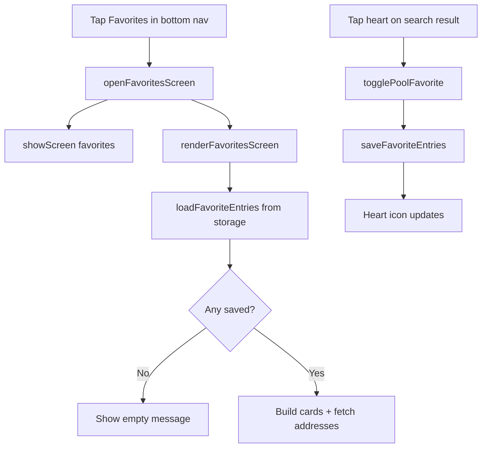
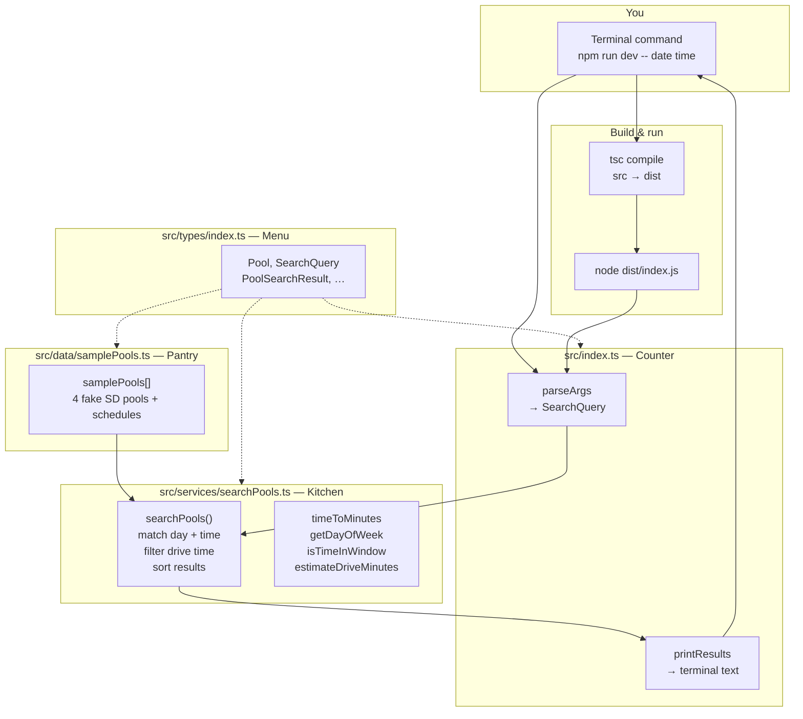
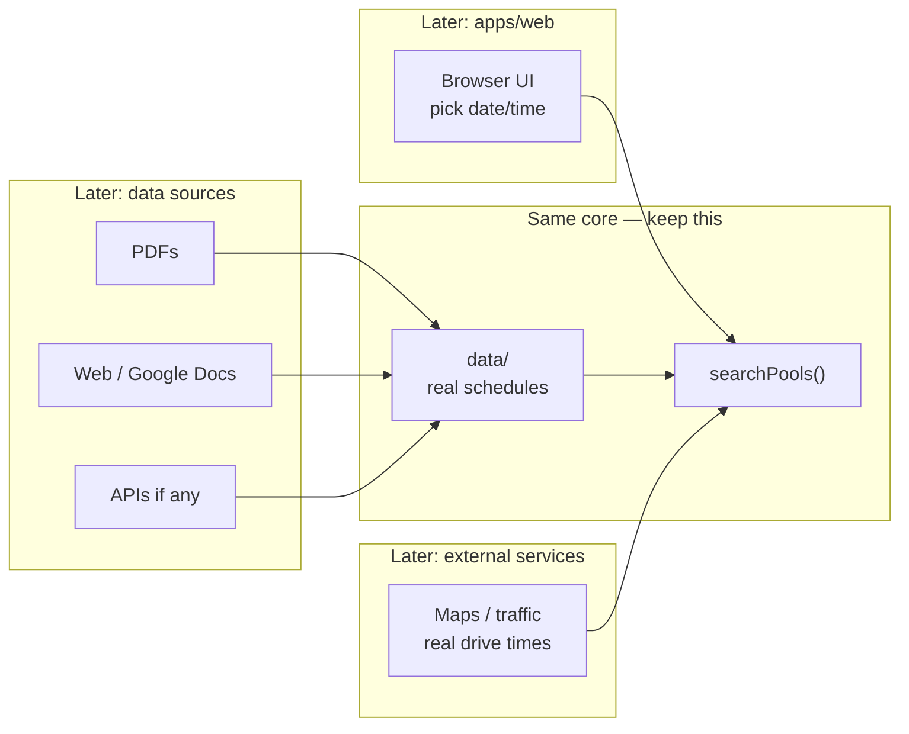

# Project cheat sheet

## The restaurant analogy


| Folder / file    | Role                                                                      |
| ---------------- | ------------------------------------------------------------------------- |
| `src/types/`     | Menu definitions — what a pool, search, and result must include           |
| `src/data/`      | Pantry — `pools.json` real schedules only (`samplePools.ts` is demo-only) |
| `src/services/`  | Kitchen — picks pools that match your date/time                           |
| `src/index.ts`   | Terminal counter — CLI; prints answers in the terminal                    |
| `src/server.ts`  | Web counter — serves the browser page and `/api/search`                   |
| `src/web/app.ts` | Browser logic — date/time UI, calls the API, draws results                |
| `public/`        | What you see — `index.html`, `styles.css`, `hero-swimmer.png`             |


## When you run the app

**Terminal (CLI):**

1. `npm run dev` (optional: `-- date time`)
2. TypeScript in `src/` compiles to JavaScript in `dist/`
3. Node runs `dist/index.js`
4. Load pools → search → print results

**Browser (web UI):**

1. `npm run web`
2. Open **[http://localhost:3000](http://localhost:3000)** in Chrome/Safari (edit files in Cursor; view the app in the browser)
3. Node runs `dist/server.js` — serves `public/` and answers `/api/search`
4. Click **Find Open Lanes** → browser requests API → same kitchen → results on screen 2

## Config files (not the app logic)

- `**package.json`** — project name + npm shortcuts (`build`, `start`, `dev`)
- `**tsconfig.json`** — TypeScript rules; `src/` → `dist/`
- `**.gitignore**` — don't commit `node_modules/` or `dist/`
- `**README.md**` — how to install and run (for you)

## Main code files (read in this order)

1. `src/types/index.ts` — data shapes
2. `src/data/samplePools.ts` — 4 fake SD pools
3. `src/services/searchPools.ts` — matching + sort
4. `src/index.ts` — CLI entry, calls search

## Request funnel (one query)

1. Terminal: `npm run dev -- date time`
2. **Counter** (`index.ts`): `parseArgs` → `SearchQuery` → call `searchPools(samplePools, query)`
3. **Kitchen** (`searchPools.ts`): for each pool — match day + time window → else skip → drive filter → add to results → sort
4. **Counter**: `printResults` → text in terminal

Example: Mon `2026-05-18` `06:30` → La Jolla + Mission Valley + Coronado; UCSD skipped (no Monday in sample data).

## Quick glossary


| Term                           | Meaning                                                                                                                                                                                                                                                          |
| ------------------------------ | ---------------------------------------------------------------------------------------------------------------------------------------------------------------------------------------------------------------------------------------------------------------- |
| TypeScript                     | JavaScript with type checklists                                                                                                                                                                                                                                  |
| Build / compile                | Turn `.ts` files into `.js` in `dist/`                                                                                                                                                                                                                           |
| `src/`                         | Source code you edit                                                                                                                                                                                                                                             |
| `dist/`                        | Compiled output Node runs (regenerate with `npm run build`)                                                                                                                                                                                                      |
| Node                           | Runs JavaScript on your computer                                                                                                                                                                                                                                 |
| npm                            | Installs packages; runs scripts from `package.json`                                                                                                                                                                                                              |
| `npm install`                  | Download `devDependencies` into `node_modules/`                                                                                                                                                                                                                  |
| `devDependencies`              | Build tools (here: TypeScript), not the swim logic itself                                                                                                                                                                                                        |
| `node_modules/`                | Installed packages; don't edit; don't commit                                                                                                                                                                                                                     |
| `npm run dev`                  | Build (`tsc`) then run (`node dist/index.js`)                                                                                                                                                                                                                    |
| Interface                      | Checklist for what fields an object must have                                                                                                                                                                                                                    |
| `export` / `export interface`  | Let other files import that type or value                                                                                                                                                                                                                        |
| `import type`                  | Import types only (erased when compiled)                                                                                                                                                                                                                         |
| `string`                       | Text in quotes, e.g. `"06:30"`                                                                                                                                                                                                                                   |
| `string[]`                     | List of strings (e.g. command-line args)                                                                                                                                                                                                                         |
| `const`                        | Named value you don't reassign                                                                                                                                                                                                                                   |
| `??` (nullish coalescing)      | If the left side is only `null` or `undefined`, use the right side. Example in kitchen: drive lookup, else `30`. Does not fall back on `0` or `""`.                                                                                                              |
| OR operator (two pipes)        | Logical OR, or "use fallback when left is falsy" (`null`, `undefined`, `0`, `""`, `false`). This repo uses `??` for defaults when only "missing" should count. Written in code as two pipe characters side by side.                                              |
| CLI                            | App you run in the terminal (text in, text out)                                                                                                                                                                                                                  |
| Arguments (args)               | Extra words after the command that tell your app what to do. Example: `npm run dev -- 2026-05-18 06:30 cost` → args are `2026-05-18`, `06:30`, `cost`. Everything after `--` goes to your app, not npm.                                                          |
| `argv`                         | Short for "argument vector" — the list of strings Node hands your program. Same idea as args; `process.argv` is that list in code. Index 2+ are usually *your* args (date, time, sort).                                                                          |
| `process.argv`                 | In Node: the actual `argv` array for this run (`[node path, script path, …your args]`).                                                                                                                                                                          |
| Parse                          | Read messy text input and turn it into structured fields the code can use (e.g. date, time, sort). Not a special keyword — we name helpers `parseSomething`.                                                                                                     |
| `parseArgs`                    | Counter: parse `argv` into a `SearchQuery` (`date`, `time`, optional `sortBy`, optional `maxDriveMinutes`); returns `null` if date/time missing                                                                                                                  |
| `parseSortBy`                  | Counter: parse optional 4th CLI word into `distance` or `cost` (or ignore invalid)                                                                                                                                                                               |
| `SearchQuery`                  | What you want: `date`, `time`, optional `sortBy`, `maxDriveMinutes`                                                                                                                                                                                              |
| `samplePools`                  | Pantry: array of fake pools + schedules                                                                                                                                                                                                                          |
| `searchPools()`                | Kitchen: filter + sort; returns `PoolSearchResult[]`                                                                                                                                                                                                             |
| `Record`                       | TypeScript type for a lookup table: each **key** (string) maps to one **value** (here, a number). Example: pool id → drive minutes. Not a list — you fetch by name with brackets.                                                                                |
| Bracket lookup                 | Read one entry from a table: `table[key]`. Example: `ESTIMATED_DRIVE_MINUTES[pool.id]` → minutes for that pool, or `undefined` if the id is missing.                                                                                                             |
| `continue`                     | Skip rest of loop for this pool; move to next pool                                                                                                                                                                                                               |
| `.find()`                      | First schedule window that matches day + time                                                                                                                                                                                                                    |
| Funnel                         | Each pool in or out: match window → drive filter → results → print                                                                                                                                                                                               |
| **API**                        | **A**pplication **P**rogramming **I**nterface — an agreed way for two programs to ask each other for data. In this repo: the browser orders from `server.ts`; the server runs `searchPools()` and sends back a list. You don't put kitchen logic in the browser. |
| Request                        | The ask — e.g. browser: "lanes for 2026-05-18 at 09:00?" Implemented as a URL: `GET /api/search?date=…&time=…`                                                                                                                                                   |
| Response                       | The answer the server sends back — here, JSON text with `query` and `results`.                                                                                                                                                                                   |
| Endpoint                       | One "menu item" on the server — ours is `**/api/search`** (lane search only).                                                                                                                                                                                    |
| `GET`                          | HTTP verb meaning "read data only" (no form body). Our search uses GET because date/time sit in the URL.                                                                                                                                                         |
| JSON                           | Text shaped like `{ "name": "La Jolla YMCA", "lanesAvailable": 4 }` — easy for TypeScript/JavaScript to parse.                                                                                                                                                   |
| `localhost`                    | "This computer." `**localhost:3000`** = web app running on your machine while you develop (not on the public internet).                                                                                                                                          |
| `fetch()`                      | Browser built-in: send a request to a URL and get the response (used in `src/web/app.ts` for `/api/search`).                                                                                                                                                     |
| **curl**                       | Terminal tool to fetch a URL and print the response — test the **API** without a browser. Same **Endpoint** as `fetch()`: e.g. `curl "http://localhost:3000/api/search?date=…&time=…"` sends a **GET** **Request**; server sends back **JSON** **Response**.     |
| `npm run web`                  | Build TypeScript, then start `dist/server.js` — open [http://localhost:3000](http://localhost:3000) to use the UI sample.                                                                                                                                        |
| HTML                           | Page skeleton — boxes and labels in `public/index.html` (what exists on screen before JavaScript runs).                                                                                                                                                          |
| CSS                            | Paint and layout — colors, spacing, fonts in `public/styles.css`.                                                                                                                                                                                                |
| DOM                            | **D**ocument **O**bject **M**odel — the live page the browser builds from HTML; TypeScript reads and updates it.                                                                                                                                                 |
| `hidden`                       | HTML attribute that hides an element until JavaScript removes it (used on `#screen-favorites` until you tap Favorites).                                                                                                                                          |
| `getElementById()`             | TypeScript helper: grab one page element by its `id` (e.g. `favorites-list`). The `!` after means “this exists.”                                                                                                                                                 |
| `classList.toggle()`           | Turn a CSS class on or off — e.g. highlight the active bottom-nav tab.                                                                                                                                                                                           |
| `localStorage`                 | Browser storage that keeps data after you close the tab (used for saved ♡ pools).                                                                                                                                                                                |
| `sessionStorage`               | Browser storage for one visit only — common fallback in Safari private mode.                                                                                                                                                                                     |
| `FavoriteEntry`                | TypeScript interface: `{ poolId, name }` — one saved pool in storage.                                                                                                                                                                                            |
| `togglePoolFavorite()`         | Add or remove a pool from favorites; saves to storage; returns `true` / `false` / `null` (save failed).                                                                                                                                                          |
| `renderFavoritesScreen()`      | Read storage → build HTML for `#favorites-list` (or empty message) → wire heart buttons.                                                                                                                                                                         |
| `showScreen()`                 | Show one of three tabs: `"search"`, `"results"`, or `"favorites"`; hides the others.                                                                                                                                                                             |
| `var(--bg)`                    | CSS shared color (`#edf8fb`, light pool-water) — Favorites header and panel both use it so they look like one block.                                                                                                                                             |
| Modifier class (`--favorites`) | Extra class that tweaks a base style for one screen only (e.g. `.results-bar--favorites`).                                                                                                                                                                       |
| `.map()` / `.join("")`         | Build HTML from an array: `.map()` makes one string per item; `.join("")` glues them into one block for `innerHTML`.                                                                                                                                             |
| `async` / `await`              | Wait for slow work (e.g. `fetch("/api/pools")` for addresses) before finishing `renderFavoritesScreen()`.                                                                                                                                                        |
| `wireFavoriteButtons()`        | Attach tap handlers to each ♥ button (works reliably on iPhone Safari).                                                                                                                                                                                          |
| `innerHTML`                    | Replace everything inside an element with new HTML text (how the favorites list gets drawn).                                                                                                                                                                     |


### Favorites tab (browser)

Three layers work together:


| Layer     | File                | Job                                                                                                         |
| --------- | ------------------- | ----------------------------------------------------------------------------------------------------------- |
| Structure | `public/index.html` | `#screen-favorites`, title bar, hint line, empty `#favorites-list`                                          |
| Look      | `public/styles.css` | `.results-bar--favorites` + `.panel--favorites` share `var(--bg)`; no gap between title and “Saved with ♡…” |
| Behavior  | `src/web/app.ts`    | Save/load hearts, switch tabs, build list cards                                                             |


**Page pieces (`index.html`):**

- `#screen-favorites` — whole Favorites tab (starts `hidden`)
- `#favorites-hint` — “Saved with ♡ on search results” (or a Safari storage warning)
- `#favorites-list` — starts empty; TypeScript fills it with saved pool cards

**What happens when you tap Favorites:**

1. `openFavoritesScreen()` → `showScreen("favorites")` (hide Home/Results)
2. Check whether the browser can save data (`probeFavoritesStorage()`)
3. Set hint text → `renderFavoritesScreen()` loads from storage and paints cards

**What happens when you tap ♡ on a search result:**

1. `handleFavoriteHeartTap()` reads `data-pool-id` and `data-pool-name` from the button
2. `togglePoolFavorite()` adds or removes `{ poolId, name }` in storage
3. Heart icon updates; if you’re on Favorites, the list redraws

**Storage fallback order:** `localStorage` (keeps after close) → `sessionStorage` (one visit) → in-memory array (if Safari blocks storage).

**CSS fix (no white gap):** Header had `margin-bottom` showing white `.app` background between “Favorites” and the hint. Set `margin-bottom: 0` and the same flat `var(--bg)` on header + panel so they read as one block.




| Piece     | File                                                   | Role                                  |
| --------- | ------------------------------------------------------ | ------------------------------------- |
| Customer  | Browser + `src/web/app.ts`                             | Clicks Find Open Lanes                |
| Counter   | `src/server.ts`                                        | Receives `/api/search`, calls kitchen |
| Kitchen   | `src/services/searchPools.ts`                          | Same funnel as CLI                    |
| Menu line | `GET /api/search?date=&time=&sortBy=&maxDriveMinutes=` | The only API endpoint in V0           |


**Why use an API?** Same kitchen can serve CLI, web, and later a phone app — only the "how you order" changes (terminal args vs URL).

## Weekdays in code (`dayOfWeek`)

0 = Sunday · 1 = Monday · 2 = Tuesday · 3 = Wednesday · 4 = Thursday · 5 = Friday · 6 = Saturday

## System diagrams

How the pieces fit together. View in Cursor/GitHub preview, or paste the `mermaid` blocks into [mermaid.live](https://mermaid.live).

### V0 today (what's in the repo)




**One request:** You type date/time → counter builds a question → kitchen checks each pool in the pantry → counter prints what survived the funnel.

**Code path to follow:** `index.ts` (bottom) → `searchPools.ts` → `samplePools.ts` → back to `printResults`.

### Later (product vision — not built yet)




**Idea:** UI and data collection change; `searchPools` + types stay the center.

---

## Michelle feedback

Notes from real user testing:

1. **Results header looks like a button** — The “Open Lanes” heading is styled like a primary call-to-action, not a page title. It should read clearly as a heading.
2. **Time picker is slow for other times** — Selecting any time other than right now requires too much scrolling on the wheel. We need a faster way to jump to a time.
3. **Explain why a pool is excluded** — When a pool doesn’t appear in open-lane results, show why it was filtered out (for example: no lanes open at that time).
4. **Simplify favorites on Home** — Don’t show favorites above **Find Open Lanes**; that placement is confusing. Show favorited pools in search results with a heart instead. If a favorite isn’t open at the chosen time, still surface it and explain why not.
5. **Favorites shouldn’t require another search tap** — Checking a saved pool from Favorites shouldn’t force the user to press **Find Open Lanes** again; one tap should be enough.

---

## Session learnings (saved)

**Organization:** menu (`types/`) → pantry (`data/`) → kitchen (`services/`) → counter (`index.ts`).

**Flow:** Input date/time → `searchPools` funnel (match window → drive filter → sort) → printed summary (not a raw data dump).

**Concepts touched:** `export interface`, `string` / `string[]`, `const`, `parseArgs` / `process.argv`, `npm install` / `node_modules` / `devDependencies`, compile `src` → `dist`.

**Still building depth on:** line-by-line kitchen logic — revisit when we change that code.

**Thursday lunch trace (2026-05-21 12:15):** Only Coronado — its pantry window is Thursday `12:00`–`13:30`. UCSD has Thursday AM only (`06:00`–`08:00`), so 12:15 is out. Contrast: Monday `2026-05-18` `12:15` → La Jolla only (Monday lunch `12:00`–`13:00`).

**Product stance:** incremental slices + small ships (CLI → web → one real pool); tiny feature next.

**Repo state:** All `src/` files have learning comments; `npm install` has been run at least once in this project.

---

## Resume here (next session)

**Use a new Agent chat** (not this thread). Open folder `Prototype Exercise`; Cursor reads `AGENTS.md` automatically.

**Read first:** This section, `AGENTS.md`, `VISION.md`, and `MOBILE.md` (PostHog + phone testing).

### Welcome back

**North star:** You pick a date and time; the app shows which San Diego pools have a **lap lane open then**. Distance and guest pass cost only help you choose among pools that already match.

**Latest commit:** `5d8d08e` — Michelle UX (results header, time picker, exclusions, favorites), see-more/collapsed sections, PostHog in code. **Working tree clean.**

**GitHub username:** `ys4vnkdnyt-create`  
**Repo (created):** [ys4vnkdnyt-create/sdpoolapp](https://github.com/ys4vnkdnyt-create/sdpoolapp)  
**Remote (already set):** `https://github.com/ys4vnkdnyt-create/sdpoolapp.git`

**Blocked:** Push to GitHub (403 — token lacks write permission), then Render + PostHog.

**403 error you saw:** `Permission to ys4vnkdnyt-create/sdpoolapp.git denied to ys4vnkdnyt-create` — GitHub recognizes your username; the **token/password is read-only or wrong**. Not a repo-name problem.

**Full fix steps:** see **`scripts/github-push-help.md`**

**Short version:**
1. Keychain Access → delete all **github.com** passwords
2. [Classic token](https://github.com/settings/tokens) → check **`repo`** → copy `ghp_…`
3. `git push -u origin main` — username `ys4vnkdnyt-create`, password = **token** (not Apple password)

**After push succeeds → Render:**
1. [dashboard.render.com](https://dashboard.render.com) → **New +** → **Blueprint** → connect **sdpoolapp** → **Apply**
2. **Environment** → `POSTHOG_KEY` = your `phc_…` key → redeploy
3. Confirm events in PostHog **Activity**

**Run the app locally:**

```bash
cd "/Users/benstern/Prototype Exercise"
npm run web
# → http://localhost:3000
```

On your phone, follow **MOBILE.md** (local URL or tunnel as documented there).

---

### PostHog — done in code, finish in dashboard

Analytics is wired but **off locally** unless you set a key. Keys never go in git — the server injects them at `/config/analytics.js`.

**Env vars (Render → Environment):**


| Variable                     | Required        | Notes                                              |
| ---------------------------- | --------------- | -------------------------------------------------- |
| `POSTHOG_KEY`                | Yes (to enable) | Project API key from PostHog (`phc_…`)             |
| `POSTHOG_HOST`               | No              | Default `https://us.i.posthog.com`                 |
| `POSTHOG_FEEDBACK_SURVEY_ID` | No              | Survey ID — **Feedback** button opens this popover |


Local test: `POSTHOG_KEY=phc_your_key npm run web`

**How it works (no bundler):**

- Server serves `/config/analytics.js` (config from env) and `/vendor/posthog-js.js` (from `node_modules`)
- `index.html` uses an import map so `app.ts` can import PostHog in TypeScript
- Empty/missing `POSTHOG_KEY` → analytics disabled (dev-friendly)

**Events tracked:**


| Event                   | When                                                      |
| ----------------------- | --------------------------------------------------------- |
| `app_loaded`            | Page load (when key is set)                               |
| `screen_view`           | Home, results, or favorites screen                        |
| `search_submitted`      | Search finished — date, time, sort, result count (no GPS) |
| `favorite_toggled`      | Heart tapped — pool id + favorited                        |
| `feedback_link_clicked` | **Feedback** link tapped (above bottom nav)               |


**Your to-do in PostHog (one-time):**

1. Sign up at [posthog.com](https://posthog.com) → create a project.
2. **Project settings** → copy **Project API key** (`phc_…`) → paste into Render as `POSTHOG_KEY` → redeploy.
3. **Surveys** → **New survey** → **Popover** (mobile-friendly).
4. Add question(s), e.g. “What would make this app more useful?”
5. **Release conditions** — pick one:
  - **Automatic** — show after N page views or on a delay
  - **Event-triggered** — release on event `feedback_link_clicked`
  - **Feedback button** — copy survey ID into `POSTHOG_FEEDBACK_SURVEY_ID` on Render
6. Set survey to **Active** → save.
7. Use the app on your Render URL → confirm events in PostHog **Activity**.

Full detail also in **MOBILE.md** → “PostHog (analytics + surveys)”.

**Build verified:** `npm run build` passes.

---

## Roadmap

**Now** — Friends test; read PostHog + feedback  
**Next** — Fix top 3 confusions from testers  
**Then** — Add real schedules for pools people actually search  
**After** — Show source / last updated so answers feel trustworthy  
**Later** — Drive time, better guest-pass costs, radius filter  

**Not now** — Multi-city, workouts, accounts, big redesign  

**Priority:** lane open at your time → more pools with real data → everything else

---

**Focus next session:** Friend-test feedback → roadmap **Next** items. Live app: https://lapfinder.onrender.com · latest commit on `main`.

**Paste into new Agent chat:**

```
I'm back on SD Lap Lane Finder. Read notes.md ("Resume here" + Roadmap). Live: lapfinder.onrender.com. Repo: ys4vnkdnyt-create/sdpoolapp. Don't paste secrets in chat.
```

